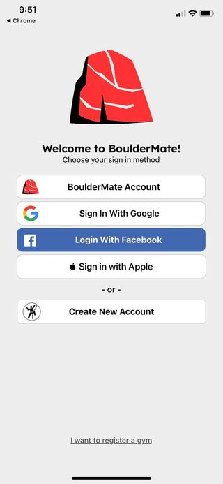

# BoulderMate
> React Native Social App for Rock Climbing and Bouldering

This repository has a monorepo structure, where all components of the application can be found inside the `packages` folder.

## Installation

#### API

To run the API successfully one first needs to define the environment in their `.env` file
This has been templated in the package and just needs to be filled out with valid values.

The API package can then be run with
```
npm install && npm run serve
```

**Disclaimer:** 
If this is your first time running the application, you may need to run beforehand
```
npx prisma db push
```
In order to initialise the prisma schema in CockroachDB

#### Mobile App

Running the mobile app can be more complicated if you have no prior experience doing so, but Expo Go offers a relatively simple method if you're just browsing.
Firstly, you need to update the templated `.env` file in the package to flesh out the field values. 

Then ensure you have <a href="https://expo.dev/client">Expo Go</a> installed on your phone, such that you can then easily run the app with
```
npx expo install && npx expo start
```
And scanning the QR code that appears in the console.

You'll know this has all worked when you see the landing page on your phone, and can create an account!

<p align="center">
  
</p>

## Contributions

### Running the App

There are more ways to run the app that Expo Go, in particular via the Expo Development Client - which is often necessary when using packages unsupported by Expo Go. Using the development client should be the preferred method by anyone developing the App.

First, ensure you add `EAS_PROJECT_ID` to the mobile-app `.env`, and have the eas cli installed. After this, the app can be run like so:

**Running via Simulator**
- Open a simulator
- Run ```npm run {build-android/build-ios}```
  - This will take a while
  - Needs to be redone whenever we change images or env vars
- Run ```npm run use-build``` and select the latest build
  - This should install the build onto the simulator and open an expo interface
- Then finally do ```npm run start``` - this will run expo in the development client
- When that opens, press {i/a} as instructed to run on the appropriate OS. Then the development build should be running on the simulator

**Common Issues**

- In iOS simulator, sometimes ```npm run use-build``` doesn't install properly. You want to run ```xcrun simctl shutdown all && xcrun simctl erase all``` to reset all your simulators if this happens - sometimes your computer has multiple.
- Ensure you have run  ```npm install``` in all packages and have all the necessary packages running
- Permissions issues are common on mac. If you encounter "Insufficient permissions to save", navigate to the root folder and run ```sudo chown -R <myuser> .```

### Environment Changes
If any contribution is made which requires change of the environment schema, it needs to be updated in the following places
  - This document, describing the local `.env` files
  - app.config.ts - this injects the contents of .env to the app when built with EAS
  - eas.json